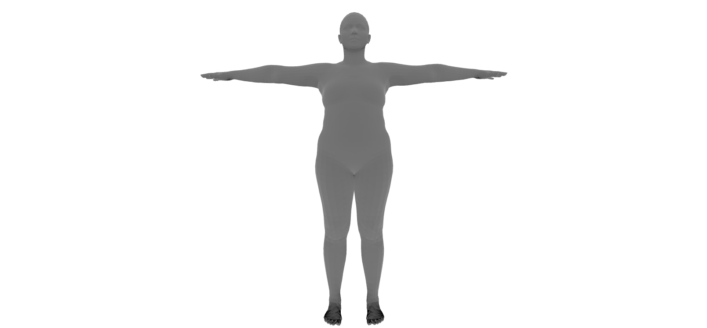

# STAR

Sparse Trained Articulated Human Body Regressor

This project is modified from [STAR](https://github.com/ahmedosman/STAR) to provide a handy way of generating body meshes.

## Installation

### 1. Install PyTorch

This package is build on top of pytorch.

See [pytorch/get-started](https://pytorch.org/get-started) for the installation guide.

### 2. Install STAR

This project is managed via `poetry` and can be easily installed via `pip`:

```sh
pip install git+https://github.com/digitaldomain-ai-research/star.git
```

If you are using `poetry`, run the following cmd instead:

```sh
poetry add git+https://github.com/digitaldomain-ai-research/star.git
```

## Quick start

The data generator is modified from [STAR](https://star.is.tue.mpg.de/).
The value of `device` can be `cpu` or `cuda`, but it needs a gpu to do the calculation either way.

```python
from star.star import STAR
import torch
import trimesh

device = "cuda"

star = STAR(gender='female')

poses = torch.zeros((1, 72), device=device)
betas = torch.randn((1, 10), device=device) * 1.25
trans = torch.zeros((1, 3), device=device)

vertices = star(poses, betas, trans).detach().squeeze().cpu()
mesh = trimesh.Trimesh(vertices, star.faces)

mesh.show()
```


